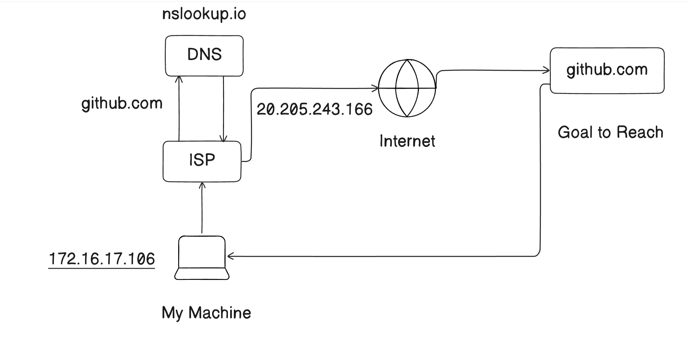
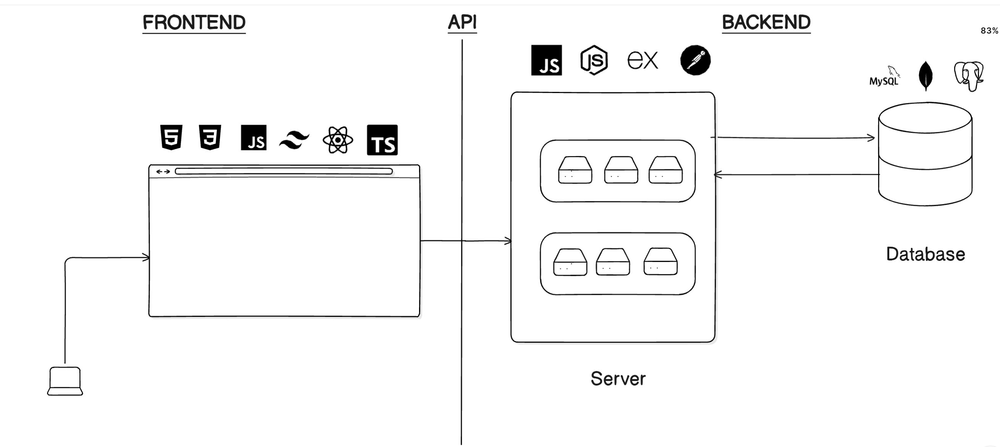

# 🌐 Basics of Web Development

## 🧠 How Does the Internet Work?

### 💭 What is the Internet?

> A global network that connects computers and devices to share information.

Imagine it like:

> **"Connecting your computer to mine"** — but through a vast network of routers, cables, and servers.

---

### 🔌 How Do Devices Connect?

A simplified step-by-step flow:

1. **Your Device** → sends a request to open a website
2. **Router / ISP** → routes your request to the internet
3. **DNS (Domain Name System)** → translates website names (like `google.com`) into IP addresses
4. **Server** → receives the request and sends back the website files
5. **Your Browser** → displays the content

---

### 📊 Visual Overview

#### How Internet works?

#### How Web App works?

